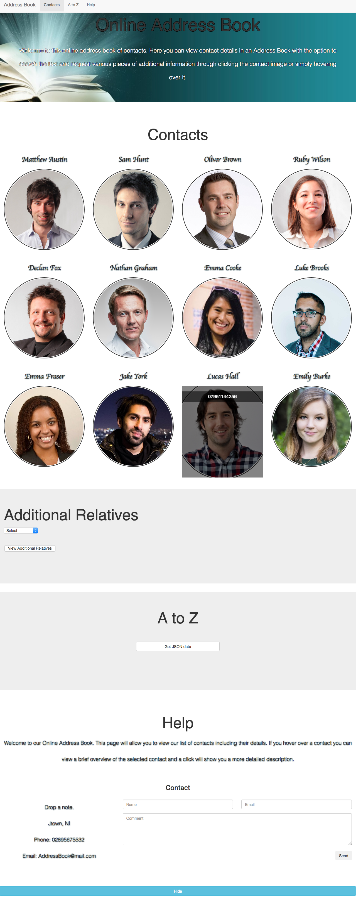
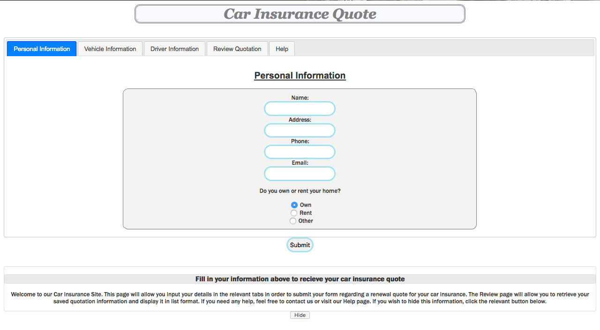

## Online Address Book

The webpage allows the user to view contact details in an Address Book with the option to request various pieces of additional information. It consists on one main HTML page that uses jQuery and leverages AJAX functionality to retrieve data. The page is used to access and display details which is stored using JSON.

The user is able to ;
 - Hover over an person and be presented with an overview of them
 - Clicking on the contact results in the provision of a more detailed description of the person.
 - Content is accessed from JSON formatted information using jQuery in order to view additional related people.
 
 
 
 
 ## Car Insurance Quote Form
 
This web page allows a car driver to review their ‘saved’ quotation for car insurance renewal. The page includes jQuery / jQuery UI components that offer the following functionality;
- Use of HTML5 doc type and associated elements and appropriate validation of input
- Use of jQuery selectors to add and remove classes and adding elements directly into the DOM such as Hide/Show/Fade/Toggle capabilities
- Event Handling, such as form field updates
- Tooltips to identify fields with errors.
- An AJAX connection to populate the web form with data via JSON

 
 
 
 ## Music Upload and Reviewal Website

The website is intended as a repository for users to upload personal music which will then be reviewed by other users. An agile model and Gantt Chart was used for organisational purposes with the following technologies used: 
- VB.NET/ASP.NET in Visual Studio 2015. 
- HTML, CSS and JavaScript/jQuery edited through Visual Studio and Brackets.
- SQL was used for the database through the Visual Studio environment.

The website contains the following features using these technologies;
- User Login functionality
- Tab and table functionality
- Database display and manipulation with user restrictions.

 
